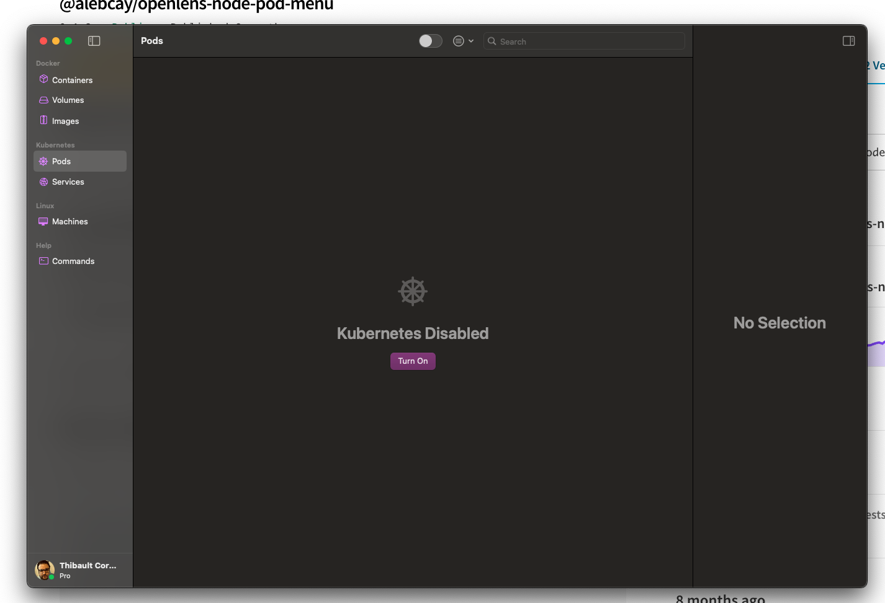

# Kubernetes Interactive Training


## Prerequisite

- Install Orbstack and activate Kubernetes
- Install **kubectl** command line (`brew install kubectl`)
- Install [OpenLens](https://github.com/MuhammedKalkan/OpenLens/releases)
  - In OpenLens, navigate to the Extensions list. In the text box, enter the name of this plugin: `@alebcay/openlens-node-pod-menu`
- Install **helm** command line (`brew install helm`)
- Install **mkcert**
 ```
  brew install mkcert
  brew install nss
  mkcert -install
  ```

### Activate Kubernetes in Orbstack

Click on **Turn On** !




Then in a terminal, test the command:

`kubectl get nodes -o wide`

The output must be someting like

```
NAME       STATUS   ROLES                  AGE   VERSION        INTERNAL-IP    EXTERNAL-IP   OS-IMAGE   KERNEL-VERSION                        CONTAINER-RUNTIME
orbstack   Ready    control-plane,master   19d   v1.27.4+orb1   198.19.249.2   <none>        OrbStack   6.5.13-orbstack-00122-g57b8027e2387   docker://25.0.3
```

